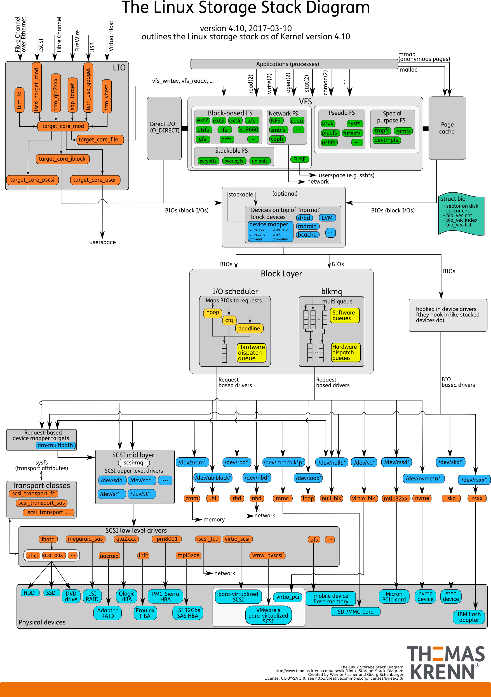
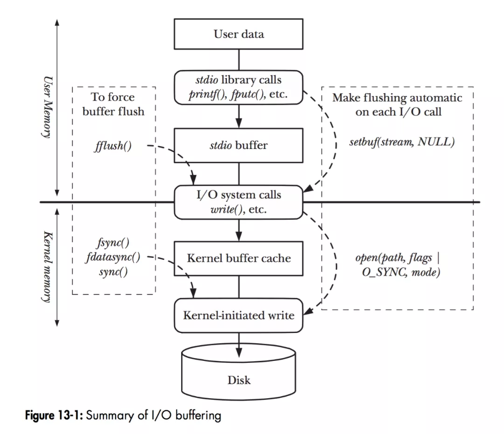
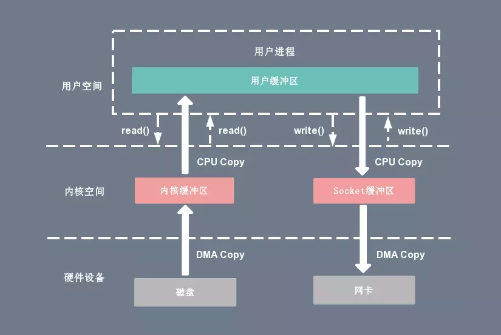
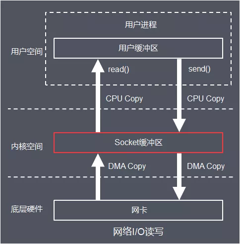
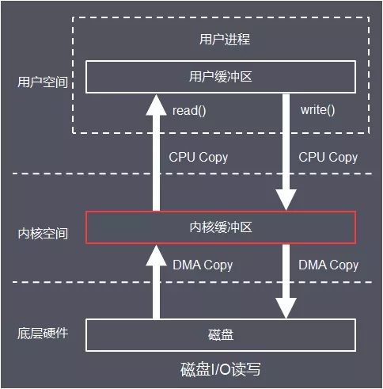

+++
author = "Hwa"
title = "Linux Storage Stack Diagram"
tags = [
    "Linux",
    "OS",
    "IO"
]
date = 2022-10-30
summary = "Linux存储栈图解"
+++

Linux存储栈：分为文件系统层，块层和设备层。

对以上进行抽象后：

BufferIO:

经典读写操作IO：从磁盘到网络

网络与磁盘读写IO：

