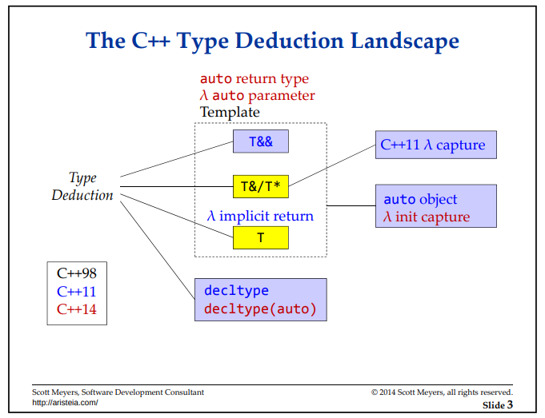
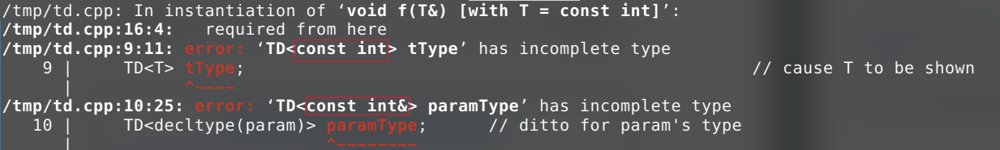
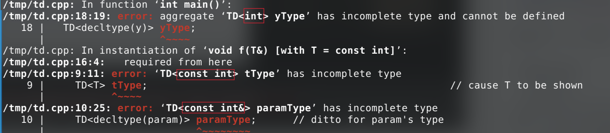
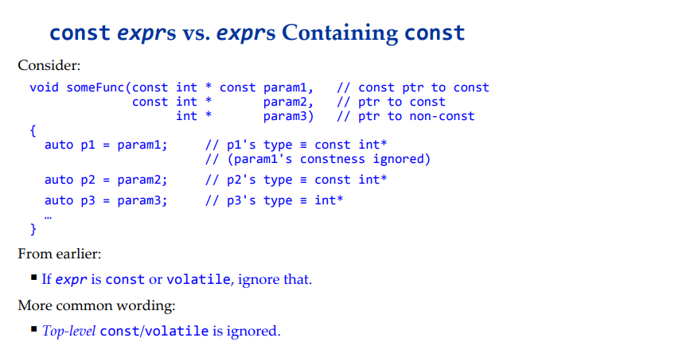
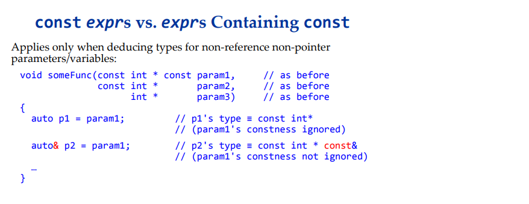
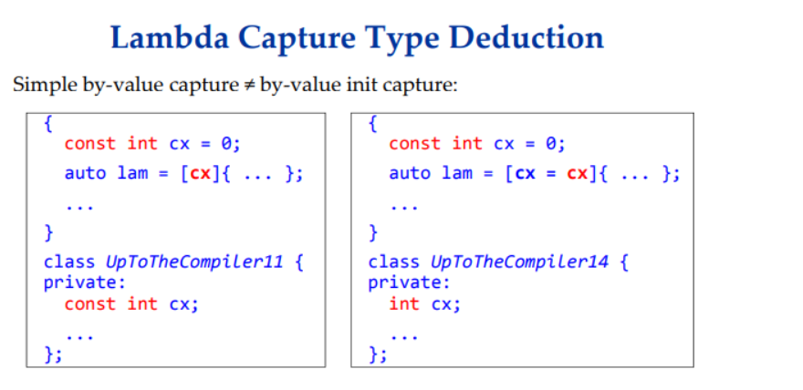
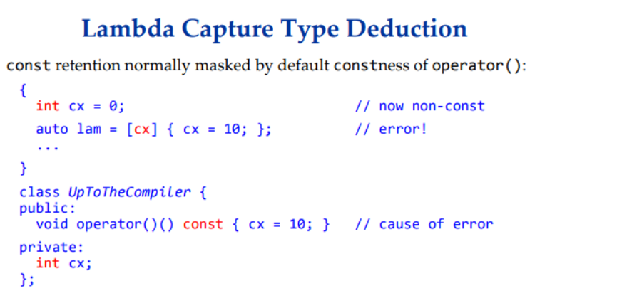
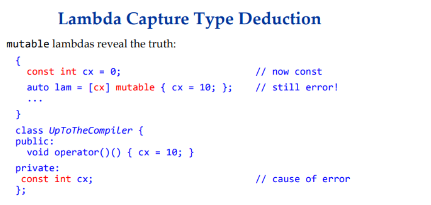

## Type Deduction and Why you Care

### 1 C++ Type Deduction Landscape



在最开始的时候，也就是C++98，只存在template deduction。对应的rule有两条，一条是给copy by value的，也就是图中的`T`；一条是给传递指针或引用的，也就是图中的`T&/T*`。一切都工作得很自然。

然后C++11出来了，带来了$auto,\ decltype,\ \lambda\ capture$和模板中的万能引用，也就是T&&。然后问题就开始膨胀了，这个时候开始出现了六条规则。如图所示。其中$\lambda$ capture的规则是改自模板的`T &/T*`。

然后C++14也出来了，带来了auto return type和$\lambda$中的auto参数以及$\lambda$ init capture，然后还有很神奇的decltype(auto)。但是这一阶段的规则并没有变多，还是这六条的复用。


### 2 Observing Deduced Types

首先介绍怎么观察编译器推断出的不同的类型：

在编译期：

使用只声明的模板来展示你关心的类型：

```cpp
template<typename T>				// declaration for TD;
class TD; 							// TD stands for "Type Displayer"

template<typename T>				// template w/types of interest
void f(T& param) 					
{
    TD<T> tType; 					// cause T to be shown
    TD<decltype(param)>	paramType; 	// ditto for param's type
}
```

```cpp
int x = 22;
const int &rx = x;
f(rx);
```

之后你就可以在编译器观察到编译器推断出的类型了：



对于`auto`变量，我们可以用`decltype`来获得他的类型，也就是：

```cpp
int x = 22;
const int &rx = x; 
auto y = rx; 
TD<decltype(y)> yType; 
```



在运行时：

Scoot Myers说，上面的方法太naive了，人也能够很轻松地分辨出来具体的类型，那我们来一个稍微复杂一点的例子：

```cpp
template<typename T>
void f(const T& param);				// template we'll call
class Widget {...};
std::vector<Widget> createVec(); 	// factory function
const auto vw = createVec();		// init vw with a factory return
if(!vw.empty()) {
    f(&vw[0]);						// in f, what are T and param's type?
    ...
}
```


### 3（auto-related)Template Type Deduction

一个常见的问题是：

```cpp
template<typename T>
void f(ParamType param);
f(expr);	// we have to deduce T and ParamType from expr
```

如果我们给出了`expr`的类型，`T`和`ParamType`分别代表什么？

+ `T`

=> 被推断出来的类型

+ `ParamType`

=> 经常与T不同，比如`const T&`

然后呢？`ParamType`经常又有三种情况：

+ `ParamType`是一个指针或者引用，但是不是一个万能引用。
+ `ParamType`是一个万能引用
+ `ParamType`既不是一个指针也不是一个引用

#### 2.1 非万能引用/指针参数

类型推导都非常简单：
+ 如果`expr`类型是一个引用，那么忽略他就可以推导出T的类型。
+ 根据`ParamType`来模式匹配`expr`的类型，以此来决定T的类型。

比如：

```cpp
template<typename T>
void f(T& param); 	// param is a reference 

int x = 22; 		// int 
const int cx = x; 	// copy of int
const int &rx = x; 	// ref to const view of int

f(x);				// T === int, param's type === int&
f(cx);				// T === const int, param's type === const int&
f(rx);				// T === const int, param's type === const int&
```

==> T not a reference 

再比如：

```cpp
template<typename T>
void f(const T& param);

int x = 22;
const int cx = x;
const int &rx = x;

f(x);				// T === int, param's type === const int&
f(cx);				// T === int, param's type === cosnt int&
f(rx);				// T === int, param's type === const int&
```

==> T not a reference

再来一个例子：

```cpp
template<typename T>
void f(T* param);	// param is now a point 

int x = 22; 		// int 
const int *pcx = &x; // ptr to const view of int 

f(&x);				// T === int, param's type === int*
f(pcx);				// T === const int, param's type === const int*
```

==> T not a pointer

主要就是一个模式匹配。

#### 2.2 auto 和非万能引用/指针变量

auto与非万能引用/指针变量一起使用时，其实扮演的就是模板类型推断里的T的角色。也就是，是一个模式匹配的类型推断规则，这也解释了为什么我们的auto总是推断不出来引用类型和指针类型。

```cpp
int x = 22;
const int cx = x;
const int &rx = x;

auto &v1 = x;				// v1 === int &, auto === int &
auto &v2 = cx;				// v2 = const int &, auto === const int
auto &v3 = rx;				// v3 = const int &, auto === const int

const auto &v4 = x;			// v4's type === const int&(auto === int)
const auto &v5 = cx;		// v5's type === const int&(auto === int)
const auto &v6 = rx;		// v6's type === const int&(auto === int)
```

 

#### 2.3 万能引用

形如下面这种形式的右值引用`"&&"`：

```cpp
template<typename T>
void f(T&& param);
f(expr);
```

他不光能够接受一个左值，也能接受一个右值。

像对待普通引用一样对待他（也就是应用模式匹配的规则来处理他），除了：

+ 如果`expr`是一个左值，并且有着被推导出的类型E，那么T会被推导出`T&`。

==> 引用会塌缩形成`E&`对于`param`参数。

```cpp
int x = 22;
const int cx = x;
const int &rx = x;

f(x);				// lvalue => T === int&, param's type = int&
f(cx);				// lvalue => T === const int&,
					// param's type === const int &
f(rx);				// lvalue => T === const int&, 
					// param's type === const int&
f(22);				// x is rvalue => no special handling; 
					// T === int, param's type is int&&
```

这个最强大的地方在于，传给我们的东西你可以不用考虑他是个左值还是右值引用，左值还是右值，我们一个`auto &&`就能够接收过来，并且保持其value category不变。甚至还能够保证其cv qualifier不发生变化。nice feature!! 不过也是有弊端的（等我了解了再说ww）。

#### 2.4 By-Value 参数

推导规则相比by-ref和by-ptr有了一些不一样的地方：

+ 和往常一样，如果`expr`的类型是一个引用，那直接引用就好了。
+ 如果`expr`是有`cv`修饰符修饰的，我们也直接忽略。
+ T是应用上述两个规则的结果。

比如：

```cpp
template<typename T>
void f(T param);				// param passed by value
int x = 22; 					// as before
const int cx = x; 				// as before
const int &rx = x;				// as before

f(x);							// T === int, param's type === int
f(cx);							// T === int, param's type === int
f(rx);							// T === int, param's type === int
```

`expr`的ref/cv-qualifiers在推导类型T的时候总是被丢掉了。

**为什么会发生这种情况呢？**

因为copy by value意味着全新的object，他有一个新的内存空间（stack or heap都无所谓）。所以管他传进来的是个cv qualifier还是引用，我们全都可以丢掉限定符。


#### 2.5 非引用非指针autos

auto在这里又扮演了模板deduction中T的角色：

```cpp
int x = 22; 				// as before
const int cx = x; 			// as before
const int &rx = x; 			// as before
auto v1 = x; 				// v1's type === int (auto === int)
auto v2 = cx; 				// v2's type === int (auto === int)
auto v3 = rx; 				// v3's type === int (auto === int)
```

又一次地，`expr`的引用和cv qualifiers都别丢掉了。


> **Summary**
>
> ok，至此我们总结完了模板参数类型的推导规则，分别是非万能引用/指针，万能引用，copy-by-value。auto和模板参数类型的推导应用的是同一套规则。然后我们可以做出如下的总结：
>
> + auto 绝对不会deduce到一个reference或pointer上（万能引用是发生了引用坍缩，不考虑）
>
> => 我们必须要手动地给auto加上引用和cv qualifier。
>
> + 如果我们非要给变量加上&类型，那我们可以使用by-reference rulesets，也就是：
>
>     ```cpp
>     auto v4 = rx; 			// v4's type === int
>     auto &v5 = rx;			// v5's type === const int&
>     auto &&v6 = rx; 		// v6's type === const int&, as rx is lvalue
>     ```

此外，在auto的类型推导的过程中：

1. 如果我们pass by value, top level的const/volatile会被丢掉：

**注意：**只有top level的被丢掉了，因为只有这样才能保证程序的语义正确。

也就是：



2. 但是，如果我们pass by reference，那么一切都不一样了，我们用的是pass by non-uref/pointer的rule，这个时候`expr`的constness就不会被丢掉：

也就是：



我是真的觉得这一套规则很尼玛蛋痛！！！但是又不得不说有其合理之处，所以真的是C++在设计的时候就过于复杂了。

然后是我们熟知的：

对于传参，或者说给auto变量赋值，如果被赋的值是一个数组（array）或者函数（function）：

+ 如果用来初始化一个引用，数组/函数的类型将会得到保留
+ 否则会在类型推导前decay到一个指针

欧克，好像说的很清楚了，对于auto 的deduction规则，但是！但是！但是！黑色星期五来了，auto的type deduction还有一条很坏的例外：

auto type deduction works the same as template type deduction, except with braced initializers:

+ 模板类型推导会失败
+ 但是auto会推断到`std::initializer_list`上。

也就是：

```cpp
template<typename T>
void f(T param);
f({1, 2, 3});				// error! type deduction fails
auto x1 {1, 2, 3}			// ill-formed
auto x1 {{1, 2, 3}};		// error! type deduction fails
auto x2 = {1, 2, 3};		// x's type === std::initializer_list<int>
```

也就是braced-init-list和模板推导一样，由于braced initializers没有类型，会fail to deduce the type。但是如果是聚合类型初始化，也就是`auto x2 = {1, 2, 3}`会被推断成一个`std::initializer_list<int>`类型。OMG, f**k CPP std committee! 


也就是说，auto基本和模板的类型推断遵循一样的规则，除了对于braced initializer的处理。对于直接初始化，应用的是模板的推导规则，对于copy-list-initialization，推导到的是`std::initializer_list<int>`。只有这么一个例外。

具体到编译器：

```cpp
auto foo{1, 2, 3};
```

g++会告诉你，`error: direct-list-initialization of 'auto' requires exactly one element`。

对于：

```cpp
auto foo{{1, 2, 3}};
```

```text
/tmp/deduce.cpp:5:21: error: unable to deduce ‘auto’ from ‘{1, 2, 3}’
    5 |   auto foo{{1, 2, 3}};
      |                     ^
/tmp/deduce.cpp:5:21: note:   couldn’t deduce template parameter ‘auto’
```

也就是说，应用的是模板的推导规则。


### 4 Lambda Capture Type Deduction

有三种capture方式：

+ by reference：使用template type deduction的ref rulesets
+ C++14's init capture: 使用auto的type deduction rulesets
+ by value: 使用template的type deduction rulesets,除了cv-qualifier有被保留下来。

哈哈哈， ****！ 

关于第一条，没什么好说的； 对于第二条，这是因为C++14的init capture本来的作用是为了将外界的一个变量move进lambda形成的闭包，有如下的形式：

```cpp
auto ptr = std::make_unique(5);
auto lam = [p = std::move(ptr)](){return *p + 5};
```

很显然，直觉上用auto的type deduction rulesets更符合表面上的一致性（ntm如果让auto的deduction rule和模板的完全一致不久不用记这么多了？）。

对于第三条规则，这是因为我们一般认为lambeda的call operator是一个const的调用，因此任何captured by value的数据成员类型都是不可修改的，这也就是为什么其cv qualifer被保存了下来。

```cpp
{
    const int cx = 0;
    auto lam = [cx] {...};
    ...
}

class UpToTheCompiler {
    private: 
    const int cx; 
    ...
}
```

那么问题就来了，C++14’s init capture表面上和auto有着一致性，但是和C++ 11的capture by value又有着不同的类型推断机制：



编程语言历史包袱多，偏底层难是可以理解的。但是这种不加思考地深入设计，是真的让人想骂人的。

带来的是什么问题呢？看下面两个例子：



lambda object本身的call operator的重载是一个const的（如果你不加mutable运算符），然后你capture by value一个non-const的int，然后就不能编译了。你说ok，你记下来这条规则了，你加上一个mutable不就行了？



是啊，你如果capture的value是一个const int，然后给他加上了一个`mutable`修饰，ok，又不能够编译了，因为lambda的copy by value capture会保留cv qualifiers。

谁看谁不乐？

可能或许必须有个人来讲讲lambda的设计历史我才能理解那群糟老头子为什么这样设计吧。
